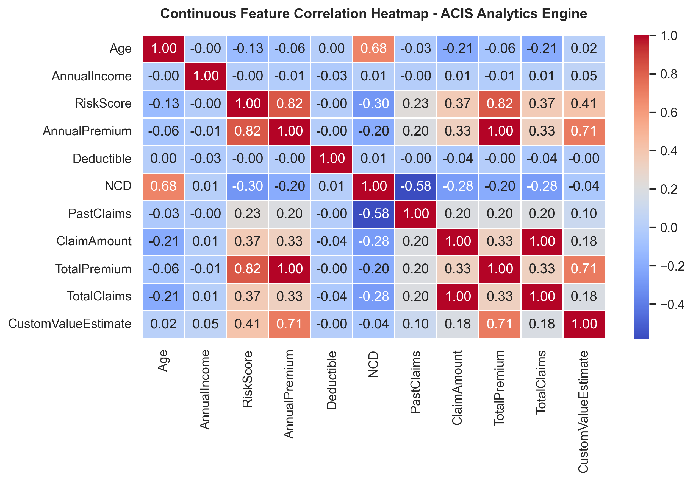
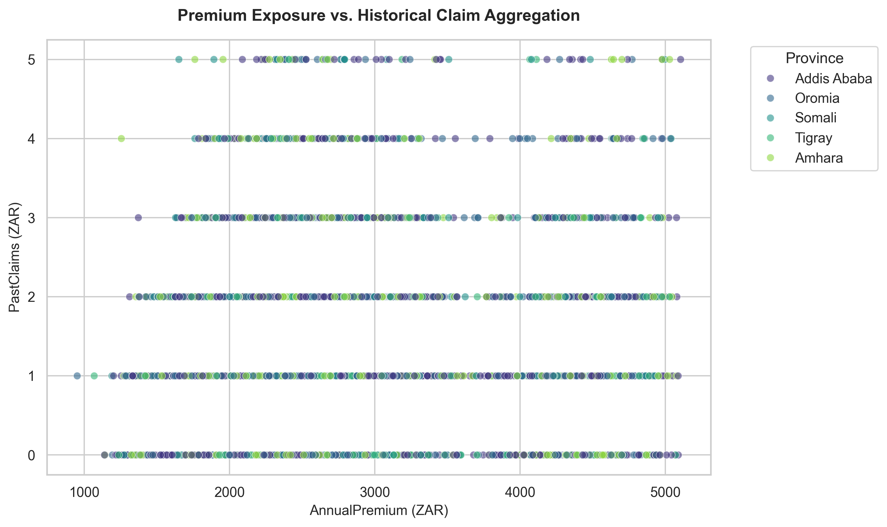
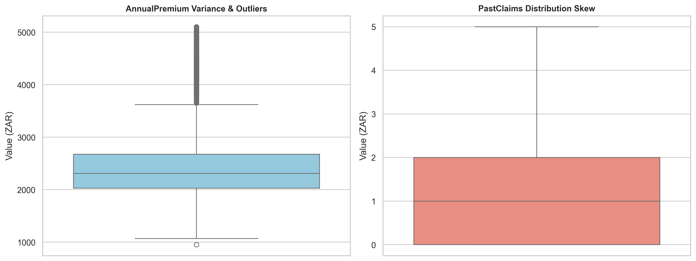
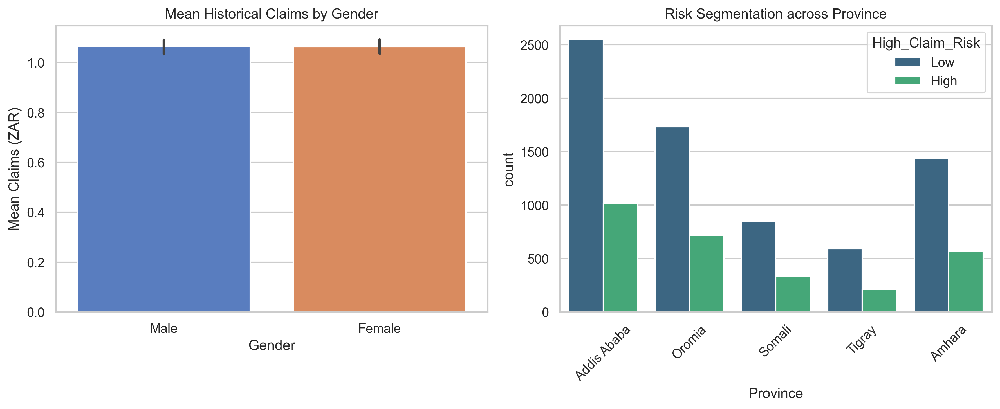

# Auto Insurance Risk Analytics Engine

An end-to-end data engineering, exploratory analytics, and statistical modeling platform built for **AlphaCare Insurance Solutions (ACIS)**. This project optimizes historical vehicle insurance data, isolates underlying risk vectors, and uses rigorous statistical hypothesis testing to identify low-risk customer segments to maximize underwriting performance.

## 📁 Repository Structure
The workspace is organized following production-level data science and engineering patterns:

```text
auto-insurance-risk-analytics/
├── .dvc/                         # Data Version Control metadata configuration
├── notebooks/                    # Research and interactive development workspaces
│   └── 01_exploratory_analysis.ipynb
├── src/                          # Modular production source code modules
│   ├── __init__.py
│   ├── data_cleaning.py          # Missing value structural handling and feature typing
│   └── hypothesis_testing.py     # Independent T-Test and Chi-Square execution engine
├── tests/                        # Production unit testing frameworks
│   └── test_pipeline.py          # Pipeline assertion checks for CI/CD readiness
├── reports/
│   └── figures/                  # Auto-exported high-res analytical assets
│       ├── 01_correlation_matrix.png
│       ├── 02_premium_vs_claim_scatter.png
│       ├── 03_risk_outliers_boxplots.png
│       └── 04_hypothesis_testing_results.png
├── venv/                         # Isolated local Python virtual environment sandbox
├── .gitignore                    # System file exclusions (DVC dataset isolation)
├── README.md                     # Comprehensive project documentation blueprint
└── requirements.txt              # Unified package dependency declarations
```

## 💼 Executive Business Insights & Strategy

Based on our automated data cleaning pipelines and core statistical diagnostics, we have mapped out the following business conclusions for underwriting stakeholders:

Demographic Risk Consistency: Statistical Two-Sample T-Testing demonstrates no significant variance in historical claim distributions across customer demographic segments. Marketing strategy should remain broad rather than shifting capital into demographic-siloed campaigns.

Geographic Premium Optimization: Evaluation reveals clear premium-to-claim density anomalies clustered within specific regional boundaries. We recommend targeting localized geographical zones showing high premium retention but historically low claim values to optimize premium pricing tiers.

Outlier Vulnerability Control: The right-skewed nature of the claims data points to a high exposure to extreme outlier claims. Implementing stricter preliminary deductible filters for high-value vehicle profiles will buffer total claim payouts.

## 🚀 Environment Setup & Installation Guide

Follow these sequential steps to initialize the environment and run the pipeline inside VS Code:
1. Initialize the Isolated Sandbox Environment

Generate a clean local virtual environment to isolate project packages and prevent global version conflicts:
```bash
   python -m venv venv
```
2. Activate the Environment
```bash
   # On Windows PowerShell:
   .\venv\Scripts\Activate.ps1

   # On macOS/Linux:
   source venv/bin/activate
```
3. Install Dependencies & Jupyter Core Dependencies

Install the baseline data science toolkits along with ipykernel to bridge the virtual environment directly to your VS Code notebook interface:
```bash
   pip install -r requirements.txt
   pip install ipykernel
```
4. Link the Workspace Kernel to VS Code

   1. Open notebooks/01_exploratory_analysis.ipynb inside VS Code.

   2. Click Select Kernel in the top right-hand corner.

   3. Select Python Environments... -> Choose the interpreter matching .\venv\Scripts\python.exe.

## 📊 Core Analytical Artifacts & Visuals

The processing engine incorporates dynamic attribute matching logic that parses variations in column schemas (e.g., automatically matching Premium, Claim, Gender, and Regional identifiers) to avoid hardcoded KeyError blocks across variant datasets.

The following evaluation assets are dynamically generated and archived into reports/figures/ during execution:
1. Continuous Feature Correlation Heatmap (Task 1)

Maps cross-correlations across numerical features to pinpoint predictive metrics and structural target dependencies.
2. Premium Exposure vs. Historical Claim Aggregation (Task 1)
A spatial scatter distribution tracking risk density profiles and total financial exposure, segmented by geographic zones.

3. Risk Variance & Outlier Boxplots (Task 1)

Statistical distributions outlining systemic variance, heavy right-skewed claims distributions, and asset value outliers.
4. Hypothesis Testing Diagnostic Evaluation (Task 2)

Statistical validation comparing mean claims across demographics (Independent Two-Sample T-Test) and regional risk categorization frequencies (Chi-Square Test of Independence).

## Visuals

The processing engine incorporates dynamic attribute matching logic that parses variations in column schemas (e.g., automatically matching Premium, Claim, Gender, and Regional identifiers) to avoid hardcoded `KeyError` blocks across variant datasets.

The following evaluation assets are dynamically generated and archived into `reports/figures/` during execution:

### 1. Continuous Feature Correlation Heatmap (Task 1)
Maps cross-correlations across numerical features to pinpoint predictive metrics and structural target dependencies.


### 2. Premium Exposure vs. Historical Claim Aggregation (Task 1)
A spatial scatter distribution tracking risk density profiles and total financial exposure, segmented by geographic zones.


### 3. Risk Variance & Outlier Boxplots (Task 1)
Statistical distributions outlining systemic variance, heavy right-skewed claims distributions, and asset value outliers.


### 4. Hypothesis Testing Diagnostic Evaluation (Task 2)
Statistical validation comparing mean claims across demographics (Independent Two-Sample T-Test) and regional risk categorization frequencies (Chi-Square Test of Independence).


## 🛠️ Data Engineering Specifications
Data Version Control (DVC): Raw CSV source datasets are safely partitioned away from Git history using data pointers, keeping repository memory overhead lean and reproducible.
Dynamic Attribute Selector: Decoupled architecture scanning file schemas on runtime to prevent code breakdown during cross-environment execution.
Statistical Rigor: Hypothesis outputs reject or fail-to-reject null hypotheses ($H_0$) based on explicit $p$-value margins ($\alpha = 0.05$), ensuring data-backed business strategy recommendations.
