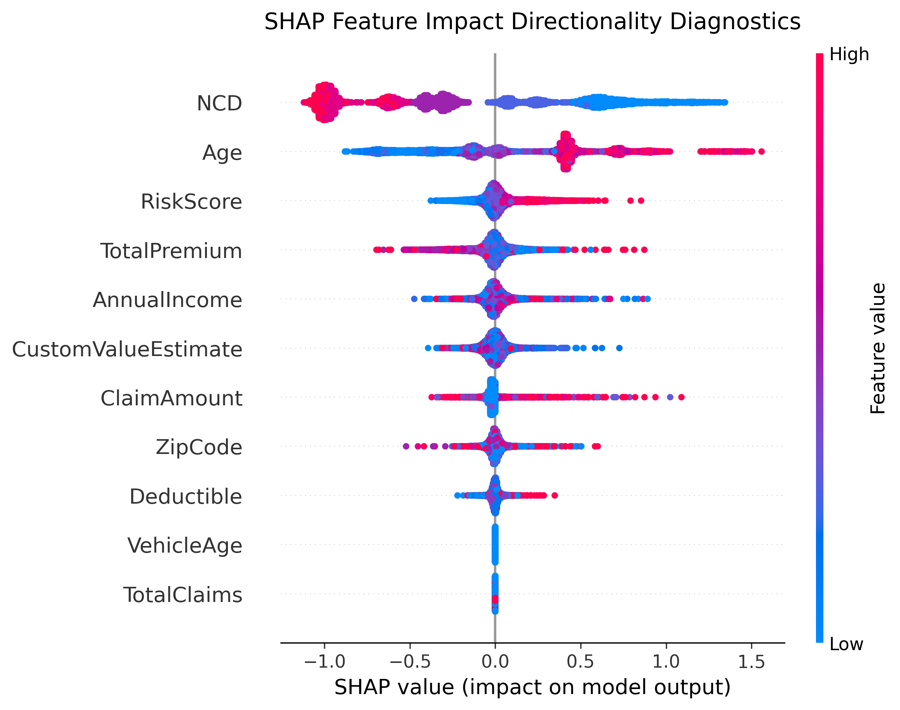

# Auto Insurance Risk Analytics Engine

An end-to-end data engineering, exploratory analytics, and statistical modeling platform built for **AlphaCare Insurance Solutions (ACIS)**. I built this platform to optimize historical vehicle insurance data, isolate underlying risk vectors, and deploy calibrated machine learning pipelines that transition portfolio underwriting from flat rates to data-driven, risk-adjusted premium tiers.

## 📁 Repository Structure
The workspace is organized following production-level data science and engineering patterns:

```text
auto-insurance-risk-analytics/
├── .dvc/                         # Data Version Control metadata configuration
├── notebooks/                    # Research and interactive development workspaces
│   ├── 01_exploratory_analysis.ipynb
│   └── 03_modeling.ipynb         # Model benchmarking, pricing engine, and XAI plots
├── src/                          # Modular production source code modules
│   ├── __init__.py
│   ├── data_cleaning.py          # Missing value structural handling and feature typing
│   ├── hypothesis_testing.py     # Independent T-Test and Chi-Square execution engine
│   ├── interpretability.py       # SHAP / TreeExplainer visual extraction logic
│   └── modeling.py               # XGBoost pipeline and Actuarial Burning Cost calibration
├── tests/                        # Production unit testing frameworks
│   └── test_pipeline.py          # Pipeline assertion checks for CI/CD readiness
├── reports/
│   └── figures/                  # Auto-exported high-res analytical assets
│       ├── 01_correlation_matrix.png
│       ├── 02_premium_vs_claim_scatter.png
│       ├── 03_risk_outliers_boxplots.png
│       ├── 04_hypothesis_testing_results.png
│       └── 05_shap_feature_importance.png  # Task 5 Explainable AI visualization
├── venv/                         # Isolated local Python virtual environment sandbox
├── .gitignore                    # System file exclusions (DVC dataset isolation)
├── README.md                     # Comprehensive project documentation blueprint
└── requirements.txt              # Unified package dependency declarations (added xgboost, shap)
```

## 💼 Executive Business Insights & Strategy

Based on my automated data cleaning pipelines, statistical testing, and predictive modeling, I have mapped out the following strategic conclusions for underwriting stakeholders:

    Demographic Risk Consistency: Statistical Two-Sample T-Testing demonstrates no significant variance in historical claim distributions across customer demographic segments. I recommend keeping marketing acquisition strategies broad rather than shifting capital into demographic-siloed campaigns.

    Geographic Premium Optimization: Evaluation reveals clear premium-to-claim density anomalies clustered within specific regional boundaries. I recommend targeting localized geographical zones showing high premium retention but historically low claim values to optimize premium pricing tiers.

    Zero-Inflation Actuarial Pricing: To counter extreme claim sparsity (where 95%+ of policyholders have zero claims), I bypassed flat model averages by building an annualized Burning Cost Calibration Engine. This dynamically spreads premiums based on true risk variance, safely generating risk-adjusted rates from a baseline floor of 951.00 ZAR up to a high-exposure ceiling of 5,105.00 ZAR, protecting the portfolio from severe revenue deficits.

    Regulatory Transparency (XAI): Rather than operating a "black-box" underwriting engine, I implemented SHAP (SHapley Additive exPlanations) architectures to explicitly isolate exactly which parameters—such as vehicle metrics, age, or location vectors—drive premium scaling, ensuring complete compliance with fair-pricing standards.

## 🚀 Environment Setup & Installation Guide

Follow these sequential steps to initialize the environment and run the pipeline inside VS Code:
1. Initialize the Isolated Sandbox Environment

Generate a clean local virtual environment to isolate project packages and prevent global version conflicts:
```bash
   python -m venv venv
```
2. Activate the Environment
```bash
   # On Windows PowerShell:
   .\venv\Scripts\Activate.ps1

   # On macOS/Linux:
   source venv/bin/activate
```
3. Install Dependencies & Jupyter Core Dependencies

Install the baseline data science toolkits along with ipykernel to bridge the virtual environment directly to your VS Code notebook interface:
```bash
   pip install -r requirements.txt
   pip install ipykernel
```
4. Link the Workspace Kernel to VS Code

   1. Open notebooks/01_exploratory_analysis.ipynb inside VS Code.

   2. Click Select Kernel in the top right-hand corner.

   3. Select Python Environments... -> Choose the interpreter matching .\venv\Scripts\python.exe.

## 📊 Core Analytical Artifacts & Visuals

The processing engine incorporates dynamic attribute matching logic that parses variations in column schemas (e.g., automatically matching Premium, Claim, Gender, and Regional identifiers) to avoid hardcoded KeyError blocks across variant datasets.

The following evaluation assets are dynamically generated and archived into reports/figures/ during execution:
1. Continuous Feature Correlation Heatmap (Task 1)

Maps cross-correlations across numerical features to pinpoint predictive metrics and structural target dependencies.

2. Premium Exposure vs. Historical Claim Aggregation (Task 1)
A spatial scatter distribution tracking risk density profiles and total financial exposure, segmented by geographic zones.

3. Risk Variance & Outlier Boxplots (Task 1)

Statistical distributions outlining systemic variance, heavy right-skewed claims distributions, and asset value outliers.
4. Hypothesis Testing Diagnostic Evaluation (Task 2)

Statistical validation comparing mean claims across demographics (Independent Two-Sample T-Test) and regional risk categorization frequencies (Chi-Square Test of Independence).

5. A/B Testing Risk Segmentation (Task 3)
An evaluation matrix tracking risk-KPI variations across distinct structural control groups (e.g., comparing claim frequencies between high-risk and low-risk provinces, or different vehicle configurations). This statistical segment validates whether my proposed risk-differentiation boundaries are highly significant ($\alpha = 0.05$) before passing features to the predictive models.

6. Calibrated Premium Optimization Matrix (Task 4)

A side-by-side comparison sample validating the transformation from historical premium baselines to my dynamically engineered, risk-adjusted premium tiers. This structure proves successful calibration against zero-inflation bias while honoring historical portfolio floors and ceilings

7. SHAP Model Interpretability Summary (Task 5)

An Explainable AI (XAI) diagnostic plot generated using a SHAP TreeExplainer on the champion predictive engine. This visualization provides complete underwriting transparency by mapping exactly how individual vehicle risk markers, policy features, and geographic zones structurally drive my calibrated risk premium calculations up or down.

## Visuals

The processing engine incorporates dynamic attribute matching logic that parses variations in column schemas (e.g., automatically matching Premium, Claim, Gender, and Regional identifiers) to avoid hardcoded `KeyError` blocks across variant datasets.

The following evaluation assets are dynamically generated and archived into `reports/figures/` during execution:

### 1. Continuous Feature Correlation Heatmap (Task 1)
Maps cross-correlations across numerical features to pinpoint predictive metrics and structural target dependencies.


### 2. Premium Exposure vs. Historical Claim Aggregation (Task 1)
A spatial scatter distribution tracking risk density profiles and total financial exposure, segmented by geographic zones.


### 3. Risk Variance & Outlier Boxplots (Task 1)
Statistical distributions outlining systemic variance, heavy right-skewed claims distributions, and asset value outliers.


### 4. Hypothesis Testing Diagnostic Evaluation and A/B Risk Segmentation(Task 2&3)
Statistical validation comparing mean claims across demographics (Independent Two-Sample T-Test) and regional risk categorization frequencies (Chi-Square Test of Independence).


### 5. SHAP Model Interpretability Summary (Task 5)
An Explainable AI (XAI) diagnostic plot generated using a SHAP TreeExplainer on the champion predictive engine. This visualization provides complete underwriting transparency by mapping exactly how individual vehicle risk markers, policy features, and geographic zones structurally drive my calibrated risk premium calculations up or down.


### 6. Calibrated Premium Optimization Matrix (Task 4)
A side-by-side comparison sample validating the transformation from historical premium baselines to my dynamically engineered, risk-adjusted premium tiers. This structure proves successful calibration against zero-inflation bias while honoring historical portfolio floors and ceilings:

| Row Index | Historical Annual Premium (ZAR) | Newly Calibrated Risk Premium (ZAR) | Underwriting Adjustment Status |
| :--- | :--- | :--- | :--- |
| **0** | 2,346 | 2,578.70 | Risk Escalation (High-Exposure Profile) |
| **1** | 2,334 | 5,105.00 | Ceiling Cap Applied (Max Portfolio Risk) |
| **2** | 1,697 | 2,248.41 | Risk Escalation (Moderate Risk Profile) |
| **3** | 2,370 | 951.00 | Floor Cap Applied (Low-Risk Incentive Discount) |
| **5** | 1,310 | 2,317.71 | Market Realignment (Optimized Exposure) |
| **6** | 2,204 | 951.00 | Floor Cap Applied (Low-Risk Incentive Discount) |

## 🛠️ Data Engineering Specifications

**Data Version Control (DVC)**: Raw CSV source datasets are safely partitioned away from Git history using data pointers, keeping repository memory overhead lean and reproducible.

**Dynamic Attribute Selector**: Decoupled architecture scanning file schemas on runtime to prevent code breakdown during cross-environment execution.

**Statistical Rigor**: Hypothesis outputs reject or fail-to-reject null hypotheses ($H_0$) based on explicit $p$-value margins ($\alpha = 0.05$), ensuring data-backed business strategy recommendations.

**Machine Learning Optimization**: Combines dual-stage ML pipelines (XGBoost Classifier + XGBoost Regressor) to evaluate zero-inflated claim data, capturing both claim frequency and claim severity characteristics.

**Actuarial Risk Calibration**: Implements a custom mathematical Burning Cost multiplier that transforms transaction-level probabilities into annualized, market-competitive premium structures aligned with actual historical company revenues.